# @rvct/phoenix

`@rvct/phoenix` transforms a Phoenix [Channel](https://hexdocs.pm/phoenix/js/#channel) instance into a reactive store for channel state and outgoing messages.

## Contents

- [Motivation](#motivation)
- [Installation](#installation)
- [Basic Usage](#basic-usage)
- [Lifecycle](#store-lifecycle)
- [Adapters](#adapters)
- [References](#references)

## Motivation

The [Phoenix JavaScript client](https://hexdocs.pm/phoenix/js/) provides the channel transport primitives: [`join`](https://hexdocs.pm/phoenix/js/#channeljoin) a topic, register [`on`](https://hexdocs.pm/phoenix/js/#channelon) callbacks, [`push`](https://hexdocs.pm/phoenix/js/#channelpush) messages, and handle channel failures. `@rvct/phoenix` keeps those primitives available and adds a reactive layer for UI concerns: the current value, state updates from incoming events, join status, transport errors, outgoing push state, and mount/unmount cleanup.

## Installation

| Client | Command                     |
| ------ | --------------------------- |
| pnpm   | `pnpm add @rvct/phoenix`    |
| npm    | `npm install @rvct/phoenix` |
| yarn   | `yarn add @rvct/phoenix`    |

`@rvct/phoenix` expects the Phoenix JavaScript client to already be available in your app. Install [`phoenix`](https://www.npmjs.com/package/phoenix) separately only if your project does not already provide the `Socket` instance.

## Basic usage

```ts
import { session } from "@rvct/phoenix"
import { Socket } from "phoenix"

const socket = new Socket("/socket", {
  params: { token: window.userToken },
})

socket.connect()

const chat = session(socket, {
  topic: "chat:lobby",
})

const unsubscribe = chat.subscribe((state) => {
  console.log(state.status, state.value, state.error, state.processing)
})
```

The store state has six fields:

- `value` - the current channel state, or `null` before a value is available
- `status` - channel lifecycle status: `loading`, `ready`, `stale`, or `failed`. See [Lifecycle](#store-lifecycle).
- `error` - connection, join, transport, or close information when the session is not healthy
- `processing` - per-action flags for pushes that are waiting for a reply
- `errors` - per-action error replies from failed pushes
- `timeouts` - per-action flags for pushes that timed out

## Initial state

Pass `value` when the UI already has useful state before the [`channel.join()`](https://hexdocs.pm/phoenix/js/#channeljoin) reply arrives. Initial `value` is exposed immediately, but `status` still starts as `loading` until the channel reports a successful join.

```ts
type ChatSession = {
  value: {
    messages: Array<{ id: string; body: string; insertedAt: string }>
  }
}

const chat = session<ChatSession>(socket, {
  topic: "chat:lobby",
  value: {
    messages: [],
  },
})
```

## Join replies

By default, the successful [`channel.join()`](https://hexdocs.pm/phoenix/js/#channeljoin) reply becomes the store value. Use `connect.ok` when the server reply needs normalization or should merge with the current value.

```ts
type ChatSession = {
  value: {
    messages: Array<{ id: string; body: string; insertedAt: string }>
  }
  connect: {
    ok: {
      messages: Array<{ id: string; body: string; insertedAt: string }>
    }
    error: {
      reason: string
    }
  }
}

const chat = session<ChatSession>(socket, {
  topic: "chat:lobby",
  value: {
    messages: [],
  },
  connect: {
    ok(value, reply) {
      return {
        messages: [...(value?.messages ?? []), ...reply.messages],
      }
    },
    error(reply) {
      return reply.reason
    },
  },
})
```

## Incoming channel events

`events` is the reactive equivalent of registering [`channel.on(event, callback)`](https://hexdocs.pm/phoenix/js/#channelon) and then writing the new state yourself. Each handler receives the current value and the event payload, then returns the next value.

```ts
type ChatSession = {
  value: {
    messages: Array<{ id: string; body: string; insertedAt: string }>
  }
  connect: {
    ok: {
      messages: Array<{ id: string; body: string; insertedAt: string }>
    }
  }
  events: {
    new_msg: { id: string; body: string; insertedAt: string }
    message_updated: { id: string; body: string; insertedAt: string }
    message_deleted: {
      id: string
    }
  }
}

const chat = session<ChatSession>(socket, {
  topic: "chat:lobby",
  value: {
    messages: [],
  },
  connect: {
    ok(_value, reply) {
      return {
        messages: reply.messages,
      }
    },
  },
  events: {
    new_msg(value, message) {
      return {
        messages: [...(value?.messages ?? []), message],
      }
    },
    message_updated(value, message) {
      return {
        messages: (value?.messages ?? []).map((current) =>
          current.id === message.id ? message : current,
        ),
      }
    },
    message_deleted(value, payload) {
      return {
        messages: (value?.messages ?? []).filter((message) => message.id !== payload.id),
      }
    },
  },
})
```

## Sending messages

Use `push` to send events through the joined channel. This follows the Phoenix [`channel.push(event, payload)`](https://hexdocs.pm/phoenix/js/#channelpush) model where the event name maps to `handle_in/3` on the server channel.

```ts
chat.push("new_msg", {
  body: "Hello",
})
```

For a domain-specific API, extend the session and keep the reactive `subscribe` method. Function properties returned from `extend` become action names in `processing`, `errors`, and `timeouts`.

```ts
type ChatSession = {
  value: {
    messages: Array<{ id: string; body: string; insertedAt: string }>
  }
  actions: {
    send: {
      payload: { body: string }
      error: { reason: string }
    }
  }
}

const chat = session<ChatSession>(socket, {
  topic: "chat:lobby",
  value: {
    messages: [],
  },
}).extend((session) => ({
  send(payload) {
    return session.push("new_msg", payload)
  },
}))

chat.send({ body: "Hello" })
chat.subscribe((state) => {
  console.log(state.processing.send)
  console.log(state.errors.send.reason)
  console.log(state.timeouts.send)
})
```

The action bucket is keyed by the public extension method name, not necessarily the Phoenix event name. In the example above, `send` updates `state.processing.send` even though the server event is `"new_msg"`.

Direct `session.push(...)` calls remain available on the base session. An extended store exposes `subscribe` plus the returned domain methods, while `push` is only passed into the `extend` factory. When a direct [`channel.push(...)`](https://hexdocs.pm/phoenix/js/#channelpush) is not wrapped by an extension method, the Phoenix event name is used as the runtime action bucket.

## Store lifecycle

A session is a reactive store whose state is derived from Phoenix Channel interaction. The sequence below uses a complete `chat` store assembled from the examples above: initial chat state, join reply normalization, incoming `new_msg` events, and the `send` action that wraps `channel.push("new_msg")`.

```ts
type ChatSession = {
  value: {
    messages: Array<{ id: string; body: string; insertedAt: string }>
  }
  connect: {
    ok: {
      messages: Array<{ id: string; body: string; insertedAt: string }>
    }
  }
  events: {
    new_msg: { id: string; body: string; insertedAt: string }
  }
  actions: {
    send: {
      payload: { body: string }
      error: { reason: string }
    }
  }
}

const chat = session<ChatSession>(socket, {
  topic: "chat:lobby",
  value: {
    messages: [],
  },
  connect: {
    ok(_value, reply) {
      return {
        messages: reply.messages,
      }
    },
  },
  events: {
    new_msg(value, message) {
      return {
        messages: [...(value?.messages ?? []), message],
      }
    },
  },
}).extend((session) => ({
  send(payload) {
    return session.push("new_msg", payload)
  },
}))
```



```mermaid
%%{init: { "sequence": { "noteAlign": "left" } }}%%
sequenceDiagram
  participant App
  participant Store as store
  participant Socket as Phoenix Socket
  participant Chan as Phoenix Channel

  rect rgba(219, 234, 254, 0.35)
    Note over App,Chan: Create store and join channel
    App->>Store: session(socket, config).extend(...)
    Note over Store: {<br/>value: { messages: [] },<br/>status: "loading",<br/>error: null,<br/>processing: { send: false },<br/>errors: { send: {} },<br/>timeouts: { send: false }<br/>}

    App->>Store: subscribe(listener)
    Store->>Socket: socket.channel(topic, {})
    Socket-->>Store: Channel instance
    Store->>Chan: channel.on(...)
    Store->>Chan: channel.join()
    alt JOIN OK
      Chan-->>Store: receive("ok", reply)
      Store-->>App: emit state
      Note over Store: {<br/>value: { messages: [...] },<br/>status: "ready",<br/>error: null,<br/>processing: { send: false },<br/>errors: { send: {} },<br/>timeouts: { send: false }<br/>}
    else JOIN ERROR
      Chan-->>Store: receive("error", reply)
      Store-->>App: emit state
      Note over Store: {<br/>value: { messages: [] },<br/>status: "failed",<br/>error: { kind: "connect_error", cause: reply }<br/>}
    else JOIN TIMEOUT
      Chan-->>Store: receive("timeout")
      Store-->>App: emit state
      Note over Store: {<br/>value: { messages: [] },<br/>status: "failed",<br/>error: { kind: "connect_timeout" }<br/>}
    end
  end

  rect rgba(224, 242, 254, 0.35)
    Note over App,Chan: Receive channel event after JOIN
    Chan-->>Store: new_msg { id: "2", body: "Hi", insertedAt: "..." }
    Store-->>App: emit state
    Note over Store: {<br/>value: { messages: [{ id: "1", ... }, { id: "2", body: "Hi", insertedAt: "..." }] },<br/>status: "ready",<br/>error: null,<br/>processing: { send: false },<br/>errors: { send: {} },<br/>timeouts: { send: false }<br/>}
  end

  rect rgba(220, 252, 231, 0.35)
    Note over App,Chan: Push message and update action state
    App->>Store: send(payload)
    Note over Store: {<br/>value: { messages: [...] },<br/>status: "ready",<br/>error: null,<br/>processing: { send: true },<br/>errors: { send: {} },<br/>timeouts: { send: false }<br/>}
    Store->>Chan: channel.push("new_msg", payload)
    alt PUSH OK
      Chan-->>Store: receive("ok")
      Store-->>App: emit action state
      Note over Store: {<br/>value: { messages: [...] },<br/>status: "ready",<br/>error: null,<br/>processing: { send: false },<br/>errors: { send: {} },<br/>timeouts: { send: false }<br/>}
    else PUSH ERROR
      Chan-->>Store: receive("error", reply)
      Store-->>App: emit action state
      Note over Store: {<br/>value: { messages: [...] },<br/>status: "ready",<br/>error: null,<br/>processing: { send: false },<br/>errors: { send: { reason: "blocked" } },<br/>timeouts: { send: false }<br/>}
    else PUSH TIMEOUT
      Chan-->>Store: receive("timeout")
      Store-->>App: emit action state
      Note over Store: {<br/>value: { messages: [...] },<br/>status: "ready",<br/>error: null,<br/>processing: { send: false },<br/>errors: { send: {} },<br/>timeouts: { send: true }<br/>}
    end
  end

  rect rgba(254, 243, 199, 0.35)
    Note over App,Chan: Unsubscribe and leave channel
    App->>Store: unsubscribe()
    Store->>Chan: channel.off(...)
    Store->>Chan: channel.leave()
    Note over Store: last state remains readable, channel reference is cleared
  end
```

The arrows show when the store calls [`socket.channel`](https://hexdocs.pm/phoenix/js/#socketchannel), [`channel.on`](https://hexdocs.pm/phoenix/js/#channelon), [`channel.join`](https://hexdocs.pm/phoenix/js/#channeljoin), [`channel.push`](https://hexdocs.pm/phoenix/js/#channelpush), [`channel.off`](https://hexdocs.pm/phoenix/js/#channeloff), and [`channel.leave`](https://hexdocs.pm/phoenix/js/#channelleave). Incoming channel events configured through `events` update `value` and emit state without using the action bucket. Phoenix [`receive`](https://hexdocs.pm/phoenix/js/#pushreceive) statuses update the action bucket: `"ok"` and `"error"` come from channel replies, and `"timeout"` is emitted by the client when no matching reply arrives before the push timeout. Only the latest run for a given action can update that action bucket.

While the store is unmounted, no channel exists behind it, so pushing directly or through an extended action throws until a later subscription mounts the store again.

## Adapters

The reactive layer is built on [nanostores](https://github.com/nanostores/nanostores), but the public subscription surface is intentionally small. A session can be consumed anywhere that can subscribe to an external readable store.

The file names below are illustrative. The important split is to keep the Phoenix socket and session construction in a small client-side module, then import that readable store from framework code.

`src/lib/chat.ts`

```ts
import { Socket } from "phoenix"
import { session } from "@rvct/phoenix"

const socket = new Socket("/socket", {
  params: { token: window.userToken },
})

socket.connect()

type ChatSession = {
  value: {
    messages: Array<{ id: string; body: string; insertedAt: string }>
  }
  connect: {
    ok: {
      messages: Array<{ id: string; body: string; insertedAt: string }>
    }
  }
  events: {
    new_msg: { id: string; body: string; insertedAt: string }
  }
  actions: {
    send: {
      payload: { body: string }
      error: { reason: string }
    }
  }
}

export const chat = session<ChatSession>(socket, {
  topic: "chat:lobby",
  value: {
    messages: [],
  },
  connect: {
    ok(_value, reply) {
      return {
        messages: reply.messages,
      }
    },
  },
  events: {
    new_msg(value, message) {
      return {
        messages: [...(value?.messages ?? []), message],
      }
    },
  },
}).extend((session) => ({
  send(payload) {
    return session.push("new_msg", payload)
  },
}))
```

<details>
<summary>Svelte</summary>

Svelte can consume the exported session directly because its store contract is based on `subscribe`.

`src/lib/Chat.svelte`

```svelte
<script lang="ts">
  import { chat } from "./chat"

  let body = $state("")
  const messages = $derived($chat.value?.messages ?? [])
  const canSend = $derived(
    $chat.status === "ready" && body.trim().length > 0 && !$chat.processing.send,
  )

  function sendMessage() {
    const nextBody = body.trim()

    if (nextBody.length === 0) return

    chat.send({ body: nextBody })
    body = ""
  }
</script>

<section>
  {#if $chat.status === "loading"}
    <p>Joining chat...</p>
  {:else if $chat.status === "failed"}
    <p>Chat unavailable</p>
  {/if}

  <ul>
    {#each messages as message (message.id)}
      <li>
        <p>{message.body}</p>
        <time datetime={message.insertedAt}>{message.insertedAt}</time>
      </li>
    {/each}
  </ul>

  <form
    onsubmit={(event) => {
      event.preventDefault()
      sendMessage()
    }}
  >
    {#if $chat.timeouts.send}
      <p>Message timed out</p>
    {:else if $chat.errors.send.reason}
      <p>{$chat.errors.send.reason}</p>
    {/if}

    <label for="chat-message">Message</label>
    <input id="chat-message" bind:value={body} disabled={$chat.status !== "ready"} />

    <button type="submit" disabled={!canSend}>
      {$chat.processing.send ? "Sending" : "Send"}
    </button>
  </form>
</section>
```

</details>

<details>
<summary>React</summary>

React can bridge the same `subscribe` method through a small hook:

`src/lib/useSession.ts`

```ts
import { useEffect, useState } from "react"

type Readable<TState> = {
  subscribe(listener: (state: TState) => void): () => void
}

export function useSession<TState>(store: Readable<TState>) {
  const [state, setState] = useState<TState>()

  useEffect(() => store.subscribe(setState), [store])

  return state
}
```

`src/components/Chat.tsx`

```tsx
import { type FormEvent, useState } from "react"
import { chat } from "../lib/chat"
import { useSession } from "../lib/useSession"

export function Chat() {
  const state = useSession(chat)
  const [body, setBody] = useState("")
  const messageBody = body.trim()
  const messages = state?.value?.messages ?? []
  const isReady = state?.status === "ready"
  const canSend = isReady && messageBody.length > 0 && !state?.processing.send

  function sendMessage(event: FormEvent<HTMLFormElement>) {
    event.preventDefault()

    if (!canSend) return

    chat.send({ body: messageBody })
    setBody("")
  }

  return (
    <section>
      {state?.status === "loading" && <p>Joining chat...</p>}
      {state?.status === "failed" && <p>Chat unavailable</p>}

      <ul>
        {messages.map((message) => (
          <li key={message.id}>
            <p>{message.body}</p>
            <time dateTime={message.insertedAt}>{message.insertedAt}</time>
          </li>
        ))}
      </ul>

      <form onSubmit={sendMessage}>
        {state?.timeouts.send ? (
          <p>Message timed out</p>
        ) : state?.errors.send.reason ? (
          <p>{state.errors.send.reason}</p>
        ) : null}

        <label htmlFor="chat-message">Message</label>
        <input
          id="chat-message"
          value={body}
          disabled={!isReady}
          onChange={(event) => setBody(event.target.value)}
        />

        <button type="submit" disabled={!canSend}>
          {state?.processing.send ? "Sending" : "Send"}
        </button>
      </form>
    </section>
  )
}
```

</details>

## References

- [Phoenix Channels guide](https://hexdocs.pm/phoenix/channels.html)
- [Phoenix JavaScript client docs](https://hexdocs.pm/phoenix/js/)
- [Writing a Channels Client](https://hexdocs.pm/phoenix/writing_a_channels_client.html)
- [nanostores project](https://github.com/nanostores/nanostores)

## License

MIT
